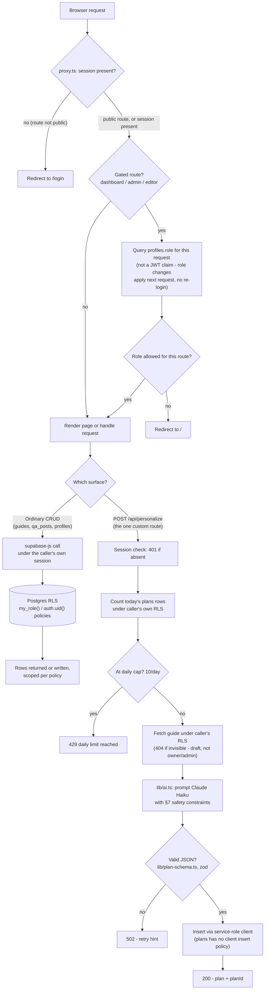

# LiftHub

A fitness hub where admin-verified trainers publish guides (workout programs,
nutrition, gym picks, recovery) and members personalize those programs to
their own equipment and schedule via an LLM, plus ask questions that trainers
answer. Built as an AiLab intern pre-assignment; the full design doc lives at
`docs/lifthub-design-v1.1.docx` and the running build log (decisions,
security-relevant reasoning, behavioral proofs for every feature) is in
`docs/NOTES.md`.

## Roles & permissions

Three roles on `profiles.role`: `member` (default at sign-up), `trainer`
(admin-verified), `admin`. Enforced in three layers — UI hides what a role
can't use (cosmetic only), `proxy.ts` blocks gated routes, and Postgres RLS
is the actual security boundary underneath both.

| | member | trainer | admin |
|---|---|---|---|
| Browse published guides, ask questions | ✅ | ✅ | ✅ |
| Personalize a guide (`POST /api/personalize`, 10/day) | ✅ | ✅ | ✅ |
| Answer questions on a guide | – | ✅ | ✅ |
| Create/edit/delete **own** guides (`/dashboard`, `/guides/new`, `/guides/[id]/edit`) | – | ✅ | ✅ |
| Edit/unpublish/delete **any** guide, any draft visible | – | – | ✅ |
| Delete **own** Q&A posts | ✅ | ✅ | ✅ |
| Delete **any** Q&A post | – | – | ✅ |
| Change a user's role / delete an account (`/admin/users`) | – | – | ✅ |

Route access, from the design doc §3.2:

| Route | Access | Enforced by |
|---|---|---|
| `/login`, `/signup` | public | — |
| `/` (browse) | signed-in | `proxy.ts` (session) |
| `/guides/[id]` | signed-in; drafts resolve only for owner/admin | `proxy.ts` + `guides_select` RLS |
| `/dashboard`, `/guides/new`, `/guides/[id]/edit` | trainer, admin | `proxy.ts` (role) + RLS |
| `/admin/users` | admin | `proxy.ts` (role) + `set_user_role` RPC |
| `/api/personalize` | signed-in, under daily cap | route handler + `plans` count |

## Architecture



`my_role()` is `security definer` so RLS policies on `profiles` can check the
caller's role without recursing into `profiles` through its own policy.
`set_user_role()` is the only path that ever changes `profiles.role` after
sign-up — the column itself is revoked from `authenticated` (migration
0004, after `0003`'s column-level revoke turned out to be a no-op against
Supabase's table-level grant; see `docs/NOTES.md`, 2026-07-09).

## Stack, and why

- **Next.js (App Router, TypeScript)** — server components read Supabase
  session/role per request (needed for the "promote takes effect next
  request, not next login" behavior), and Server Actions cover every
  mutation except the one custom route.
- **Supabase (Auth, Postgres, RLS)** — RLS is the only real authorization
  boundary; UI and `proxy.ts` are both cosmetic/UX layers on top of it.
  Ordinary CRUD goes straight through `supabase-js` under RLS rather than
  through hand-written REST endpoints, so the database enforces the same
  rule no matter which client calls it.
- **Anthropic API, `claude-haiku-4-5`** — personalize is single-shot,
  latency-sensitive, and doesn't need a large-model reasoning tier; the
  design doc (§6) calls for "a small, fast model tier" specifically. (An
  early draft defaulted to Opus out of habit and was corrected before any
  live call — see `docs/NOTES.md`, 2026-07-14.)
- **zod** — validates the model's JSON output (`lib/plan-schema.ts`) before
  it's trusted for storage or the client response; a malformed response is
  a schema failure that maps to `502`, not an unhandled exception.
- **Tailwind CSS** — utility classes, mobile-first (`flex-col`/`grid-cols-1`
  by default, `sm:`/`md:` for wider layouts).
- **react-markdown** — guide bodies are stored as markdown (`body_md`) and
  rendered, not stored as HTML.
- **Vercel** — target deploy platform per the design doc's stack.

## Setup

1. **Clone and install**

   ```bash
   git clone <this repo's URL>
   cd LiftHub
   npm install
   ```

2. **Environment** — create `.env.local` (gitignored, never committed) with:

   ```
   NEXT_PUBLIC_SUPABASE_URL=
   NEXT_PUBLIC_SUPABASE_ANON_KEY=
   SUPABASE_SERVICE_ROLE_KEY=
   ANTHROPIC_API_KEY=
   ```

   The first three come from a Supabase project's API settings; the service
   role key is server-only (used by `lib/supabase/service.ts` for the
   `plans` insert and by the admin panel's account-deletion action) and
   must never be imported into a client component. Link the local CLI to
   that same project (`supabase/config.toml` already has a `project_id`):

   ```bash
   npx supabase link --project-ref <your-project-ref>
   ```

3. **Migrations** — apply `supabase/migrations/0001`–`0004` (schema,
   triggers, RLS, then the column-grant fix) to the linked project:

   ```bash
   npx supabase db push
   ```

4. **Seed** — one user per role plus sample guides across all four
   categories (one left as a draft):

   ```bash
   npm run seed
   ```

   Creates `member@lifthub.dev`, `trainer@lifthub.dev`, `admin@lifthub.dev`,
   all with the shared dev password printed by the script on completion.
   Safe to re-run — it looks up existing users/guides by email/title before
   creating anything.

5. **Run**

   ```bash
   npm run dev
   ```

   Visit `http://localhost:3000` and sign in as any seeded account to
   explore the app as that role.
